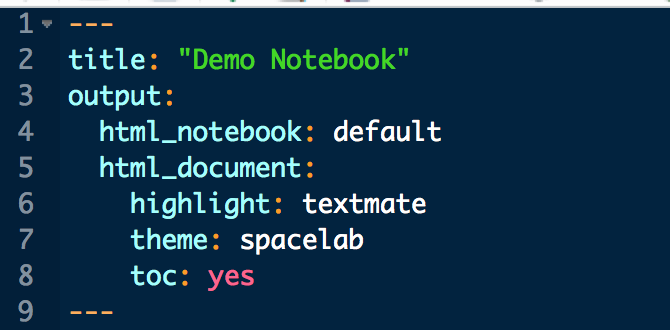
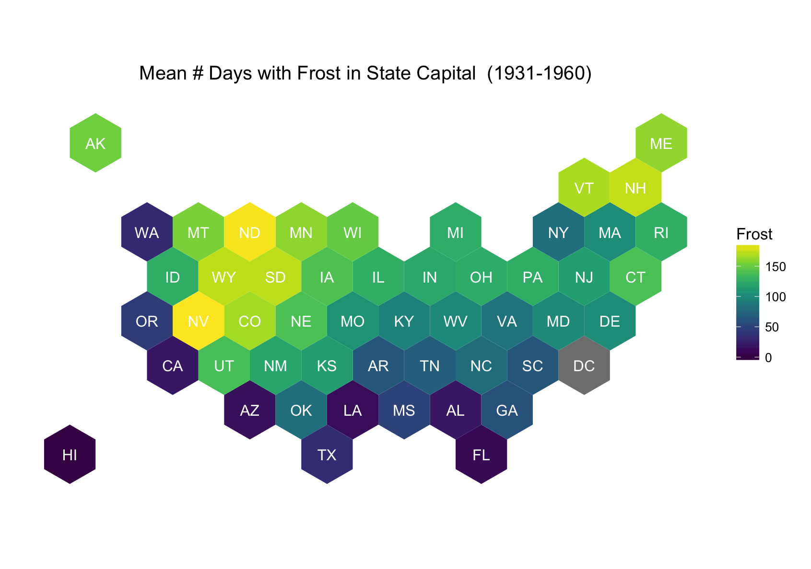

```{r setup, include=FALSE}
#knitr::opts_chunk$set(echo = TRUE)

## This line is amazing and I will tell you why...
#knitr::opts_knit$set(root.dir = normalizePath("..")) 

```

# RMarkdown

Rather than go through every detail of RMarkdown and it's wonderfully simple but extensive functionality, I'd rather **<blue>bewilder</blue>** you with a bunch of examples, give you some examples you can play with, and include a lot of links you can check out on your own time. 


# What is an RNotebook?

The main difference between an RMarkdown file (*`.Rmd`*) and a RNotebook file is the output. Notice in the `yaml` header there is a new output option? You can string these options together to output as multiple types. The main thing you'll see is a new file next to the `.Rmd` file, with a **`.nb.html`** extension. There are a few important things to know about **`.nb.html`** files.



## Using **`.nb.html`** Files

When saving, RStudio will produce or "knit" a *self-contained HTML file* which contains both a rendered copy of the notebook with all current chunk outputs (suitable for display on a website) and a copy of the notebook .Rmd itself.

### Pros  

 - Can view **`.nb.html`** file with any web browser!
 - Can be saved and shared easily!
 - Can be opened in RStudio **AND**....
    - When opened RStudio takes the **`.nb.html`** and extracts the original `.Rmd` file and places it alongside the `.nb.html` file.
    
### Caveats

 - Remember this only works if you created or saved an *RNotebook*. 
 - The new dev version of RStudio will still do inline chunk output, but doesn't produce the `.nb.html` unless you specify `html_notebook` in the yaml output.

## Code Chunks

When inserting and running code chunks in `.Rmd` files, you can can add controls for many things. In RNotebooks, this extends to some nice options to show/hide code in the html file.

Try executing this chunk by clicking the *Run* button within the chunk or by placing your cursor inside it and pressing *Cmd+Shift+Enter*. 

```{r, echo=TRUE}

plot(cars, pch=21, col="black", bg="maroon")

```


Add a new chunk by clicking the *Insert Chunk* button on the toolbar or by pressing *Cmd+Option+I*.

When you save the notebook, an HTML file containing the code and output will be saved alongside it (click the *Preview* button or press *Cmd+Shift+K* to preview the HTML file).


## HexMaps and The Electoral College

Since it's relevant and I like working with maps, let's play with some electoral maps. The electoral system is weird, but it's what we've got. The current [electoral college](https://www.archives.gov/federal-register/electoral-college/allocation.html) votes are doled out based on census data (except Washington D.C. which gets 3... just because). So, when mapping, if you were to plot the states by geographic size, or spatial components, it tends to completely skew the actual distribution of votes. So, using hexagonal tiles is a nice way to get around this. Many examples of using tiles exist, but I'll show a quick example. 

If you are interested in a few other options, check out ([statebins](https://www.r-bloggers.com/geojson-hexagonal-statebins-in-r/), [tilegramR](https://github.com/PitchInteractiveInc/tilegrams/blob/master/MANUAL.md) and this great [post](http://rpubs.com/bhaskarvk/electoral-Map-2016).

Let's take a look!


```{r hexstatebins, eval=F, echo=T}
# Load packages
library(rgdal)
library(dplyr)
library(ggplot2)
library(maptools)
library(rgeos)
library(sp)
library(viridis)

load(file = ".././data/state_DF.RData")

ogrInfo("us_states_hexgrid.geojson", "OGRGeoJSON")
us <- readOGR("us_states_hexgrid.geojson", "OGRGeoJSON")

# add XY for centroid to use for labels
centers <- cbind.data.frame(data.frame(gCentroid(us, byid=TRUE), id=us@data$iso3166_2))

# join w state data:
us<-merge(us, stateDF, by.x="iso3166_2", by.y="state.abb")
us_map <- ggplot2::fortify(model = us, region="iso3166_2")

# Plot Hex US Map
gg <- ggplot() + geom_map(data=us_map, map=us_map,
                    aes(x=long, y=lat, map_id=id),
                    color="white",fill="#ffffff", size=0.5) +
  # this is the white outline
  geom_map(data=us@data, map=us_map,
           aes(map_id=iso3166_2),
           fill="#ffffff", alpha=0, color="white",
           show.legend = FALSE)+
  # this is the fill (mean number of days with min temperature below freezing (1931–1960) in capital or large city)
  geom_map(data=us@data, map=us_map,
                    aes(fill=Frost, map_id=iso3166_2))+
  coord_map() + scale_fill_viridis() + 
  # the state label for each
  geom_text(data=centers, aes(label=id, x=x, y=y), color="white",
            size=4, show.legend = F) + 
  theme_bw() + labs(title="Mean # Days with Frost in State Capital  (1931-1960)", x=NULL, y=NULL) +
  theme(panel.border=element_blank(),
        panel.grid=element_blank(), 
        axis.ticks=element_blank(),
        axis.text=element_blank())
gg


# save it!
ggsave(filename = "./imgs/hexUS_Map.png", dpi = 200)

```


```{r get statehood year, echo=F, eval=F}

# statehood year
library(readr)
library(dplyr)

statehood<-read_tsv(".././data/statehood.txt", col_names = F)
statehood$yrs<-stringr::str_extract(statehood$X3, pattern = "\\d{4}")

# add col names
colnames(statehood)<-c("id","State","Date","Notes","Year")
statehood<-statehood[,c(2,5)]
head(statehood)

# get state data
data(state) # load state data
state.df<-as.data.frame(state.x77)
state.df$state.abb<-state.abb
state.df$State<-row.names(state.df)
head(state.df)
stateDF<-inner_join(statehood, state.df, by=c("State"))
head(stateDF)
save(stateDF, file = ".././data/state_DF.RData")

```


